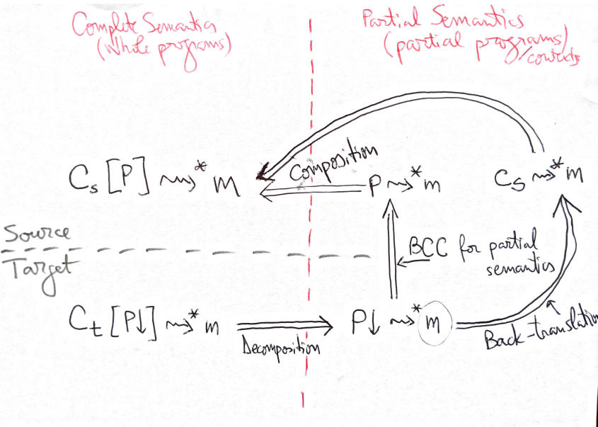
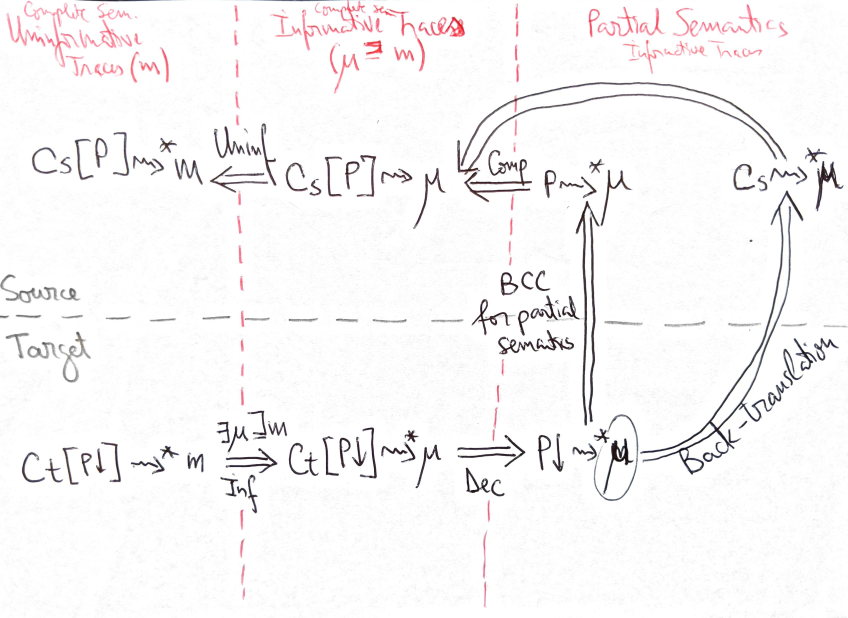
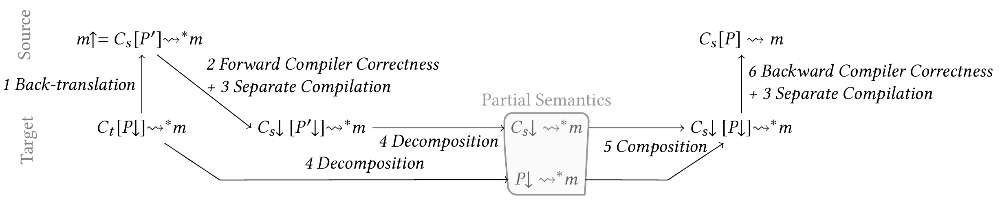

[INCLUDE=presentation]
Title         : Formally Secure Compartmentalizing Compilation
Author        : Catalin Hritcu
Affiliation   : Inria Paris
Reveal Url    : ../reveal.js
Reveal Theme  : white
Colorizer     : text
Logo          : False
Html Header   :
    <script src="../../stuff/script.js"></script>
    <link rel="stylesheet" href="../../stuff/style.css" id="custom_style">
Package       : xypic
HTML Meta     : clear
~Pre,~Code: language=text
Package       : tikz
Package       : mathtools
Tex Header    : \usetikzlibrary{decorations.shapes%
                               ,decorations.pathmorphing}
Toc Depth     : 2

~ MathDefs
[INCLUDE=../../stuff/latex.tex]
~

[//]: <> ( Madoko works poorly with Firefox, but nothing we can do about that )

[//]: <> (TODO P2: Maybe Switch to latest working Reveal.js ? One can set it like this:)
[//]: <> (Reveal Url    : https://cdn.jsdelivr.net/reveal.js/2.6.2 )
[//]: <> (Problem: main font of the slides changes to inferior one)

[//]: <> (TODO "P" is currently very overloaded: )
[//]: <> (- partial program P )
[//]: <> (- program identifier P (or C) – could use some different "unicode font" for this? )
[//]: <> (    𝐂 and 𝗣, Ⓒ and Ⓟ, 𝓒 and 𝓟, ... https://yaytext.com/double-struck/)
[//]: <> (- procedure identifier ℂ.P – rename this to ℂ.p! )

[//]: <> (TODO Why not use K for components to distinguish them from a contexts? 𝕂 := ℂ | ℙ )

[//]: <> (MOSTLYFIXED Florian)
[//]: <> ( The current font doesn't look fixed width to me for the subscripts )
[//]: <> ( Probably those don't exist in the font I chose, and )
[//]: <> (  different people are seeing different font substitutions, )
[//]: <> (  only some of which are fixed width)
[//]: <> (- (Florian:) exactly, didn't find a font with all subscript glyphs with fixed width.)
[//]: <> (  Maybe evermono but it has a completely f'd up license (shareware 25€ and only 3 cpus for its use...)


# Formally Secure Compartmentalizing Compilation #

~Center

**[C&#259;t&#259;lin Hri&#355;cu, Inria Paris](http://prosecco.gforge.inria.fr/personal/hritcu/)**

[18th International School on Foundations of Security Analysis and Design (FOSAD)](http://www.sti.uniurb.it/events/fosad18/)

[Bertinoro, Italy](https://goo.gl/maps/oqzrpd6aMfr), 27-28 August 2018
~

[//]: <> (----------------------------------------------------------------------------)

[//]: <> ( # Formally Secure (Compartmentalizing) Compilation )
[//]: <> ( ## (1h) High-level vision )
[//]: <> ( Goals: )
[//]: <> ( - explain high-level story, outlining the rest of the course )
[//]: <> ( - impress and motivate, our work is cool, foundational, and practical )

[//]: <> ( Slides in PowerPoint )
[//]: <> ( - here is a draft: )
[//]: <> ( http://prosecco.gforge.inria.fr/personal/hritcu/talks/2018-08-26-Fomally-Secure-Compilation-FOSAD.pdf )

[//]: <> ( (DONE) Secure compilation is something even broader )
[//]: <> ( - the broader thing explained in the Dagstuhl report and talk: )
[//]: <> ( http://prosecco.gforge.inria.fr/personal/hritcu/talks/2018-05-14-Secure-Compilation-Goals-and-Attackers-Dagstuhl.pdf )
[//]: <> ( - this course is focused on formally secure compartmentalizing compilation )

[//]: <> ( (DONE) Secure compilation is not just about )
[//]: <> ( - devising formal criteria )
[//]: <> ( but also about )
[//]: <> ( - devising efficient enforcement mechanisms )
[//]: <> ( - devising effective proof / verification techniques )

[//]: <> ( WONTFIX: Are too much duplication or spoilers between this part )
[//]: <> (                 and the rest a problem? Is so how to deal with it? )
[//]: <> ( - try to stay as high-level as possible here )
[//]: <> ( - WONTFIX? try to leave out too advanced topics, like: )
[//]: <> (   + where is full abstraction, they won't know what that means )
[//]: <> (   + Do I want to explain the open problems so early? Why not? Could return to them too! )

# Content

[TOC]

# Correct compilation

## What's a compilation chain? (formally)
- **Source language**
- **Target language**
- **Compiler**
- {.fragment} Soon will also add: **Linker**!
- {.fragment} **Security enforcement can happen at all these levels**:
  + source language can have nice abstractions
  + target language (machine) can include loader,
    operating system support, cool hardware features, etc
  + compiler can do static analysis or insert security checks
  + {.fragment} **so we call it "secure compilation", not just "secure compilers"**

## Source language
- whole programs: `Wₛ`
- trace-based operational semantics: `Wₛ ⇝ t`
- real-world examples: Pascal, Rust, Java, C#, ML, Haskell, ...
- {.fragment} simplifying away details: well-formedness of programs (e.g. typing)

## Target language
- whole programs: `Wₜ`
- trace-based operational semantics: `Wₜ ⇝ t`
- real-world examples: ASM (x86, ARM, RISC-V), JVM, CIL, LLVM IR, ...
- {.fragment} simplifying assumption: exactly the same traces as for source

## Compiler
- a partial (math) function "`↓`": `Wₛ↓ = Wₜ`
  + from whole source programs (`Wₛ`) to whole target programs (`Wₜ`)
- {.fragment} verified compilers are defined as such partial functions:
  + CompCert is a function in Coq
  + CakeML is a function in HOL
- {.fragment} real-world more complicated: rustc, javac, ocamlc, ghc, ...

## Simple compilation chain

### (running example)

## Simple source language: PROC
Imperative language with procedures
```
e ::= i                       integer value
    | x                       variable lookup (for now global)
    | x := e                  variable assignment (for now global)
    | e₁ ⊗ e₂                 binary operations
    | e₁; e₂                  sequence
    | if e₁ then e₂ else e₃   conditional (tests if e₁ is non-zero)
    | P(e)                    procedure call
    | arg                     read the current procedure's argument
    | exit                    terminate

D ::= P(arg) { e }            procedure declaration

W ::= D₁,...,Dₙ               whole program (where main(arg) { e } ∈ W)
```

## PROC operational semantics
```
W ⊢ M, x                     →  M, M[x]
W ⊢ M, x:=i                  →  M[x↦i], i
W ⊢ M, i₁⊗i₂                 →  M, ⊗(i₁,i₂)
W ⊢ M, i;e₂                  →  M, e₂
W ⊢ M, if i then e₂ else e₃  →  M, e₂  when i ≠ 0
W ⊢ M, if 0 then e₂ else e₃  →  M, e₃
W ⊢ M, P(i)                  →  e[arg↦i]  when P(arg) { e } ∈ W
```
~Fragment
```
E ::=                 evaluation contexts (expressions with a hole [])
    [] | x := E | E ⊗ e₂ | i₁ ⊗ E | E; e₂ | if E then e₂ else e₃ | P(E)

W ⊢ M₁, e₁ → M₂, e₂
————————————–————————————
W ⊢ M₁, E[e₁] → M₂, E[e₂]

W ⊢ M, E[exit] → M, exit
```
~
~Fragment
```
InitS(W) = W ⊢ [x↦0|x], main(0)          initial state for W
W ⊢ M, i and W ⊢ M, exit                 final states
```
~

## Events and traces: PROC+IO
```
e ::= ... | input | output e          external input and output

W ⊢ M, input    →_{Input i}  M, i
W ⊢ M, output i →_{Output i} M, i
```
~Fragment
```
α ::=                     events
    | τ                     silent event (m·τ=m)
    | Input i               visible input
    | Output i              visible output

t ::=                     traces
    | α₁·...·αₙ·Done        succesful termination
    | α₁·...·αₙ·Loop        silent divergence
    | α₁·...·αₙ·...         infinite trace
```
~
~Fragment
```
W ⇝ t ≜ (∃sf. ∃m finite, InitS(W) →*_t ∧ t = m·Done sf ∧ sf final)
            ∨ (∃m finite. InitS(W) →ω_t ∧ t = m·Loop ∧ execution infinite)
                       ∨ (InitS(W) →ω_t ∧ t infinite ∧ execution infinite)
```
~

## Simple target language: REG+IO
Abstract machine with registers
```
instr ::= Nop                     do nothing
        | Halt                    terminate the program
        | Jal l                   direct jump-and-link
        | Jump r                  indirect jump to address in r
        | Bnz r l                 direct jump if r is non-zero
        | Label l                 declare code label (direct jump target)
        | Const i -> rd           put constant i in register
        | Copy rs -> rd           write value of rs to rd
        | BinOp r₁ ⊗ r₂ -> rd     write result of r₁ ⊗ r₂ to rd
        | Load *rp -> rd          dereference rp and put result in rd
        | Store rs -> *rp         write value in rs to addres in rp
        | Input rd                external input
        | Output rs               external output

Wₜ ::= instr₁,...,instrₙ           (where no label is defined twice,
                                   and all used labels are defined)
```

## REG+IO operational semantics
```
Wₜ ⊢ M, R, PC →τ M, R, PC+1                     when Wₜ[PC] = Nop
Wₜ ⊢ M, R, PC →τ M, R[R_RA↦PC+1], offset_of(Wₜ,l) when Wₜ[PC] = Jal l,
Wₜ ⊢ M, R, PC →τ M, R, R[r]                     when Wₜ[PC] = Jump r
Wₜ ⊢ M, R, PC →τ M, R, offset_of(Wₜ,l)           when Wₜ[PC] = Bnz r l and R[r] ≠ 0
Wₜ ⊢ M, R, PC →τ M, R, PC+1                     when Wₜ[PC] = Bnz r l and R[r] = 0
Wₜ ⊢ M, R, PC →τ M, R, PC+1                     when Wₜ[PC] = Label l
Wₜ ⊢ M, R, PC →τ M, R[rd↦i], PC+1               when Wₜ[PC] = Const i -> rd
Wₜ ⊢ M, R, PC →τ M, R[rd↦R[rs]], PC+1           when Wₜ[PC] = Copy rs -> rd
Wₜ ⊢ M, R, PC →τ M, R[rd↦⊗(R[r₁],R[r₁])], PC+1  when Wₜ[PC] = BinOp r₁ ⊗ r₂ -> rd
Wₜ ⊢ M, R, PC →τ M, R[rd↦M[R[rp]]], PC+1        when Wₜ[PC] = Load *rp -> rd
Wₜ ⊢ M, R, PC →τ M[R[rp]↦R[rs]], R, PC+1        when Wₜ[PC] = Store rs -> *rp
Wₜ ⊢ M, R, PC →_{Input i} M, R[rd↦i], PC+1      when Wₜ[PC] = Input rd
Wₜ ⊢ M, R, PC →_{Output R[rs]} M, R, PC+1       when Wₜ[PC] = Output rs
```
~Fragment
```
InitS(Wₜ) = Wₜ ⊢ [addr↦0 | addr], [r↦0 | r], 0     initial states
Wₜ ⊢ M, R, PC final if Wₜ[PC] = Halt               final states
                    or Wₜ[PC] not defined
```
~

~Fragment
Simplifications: infinite memory+integers, programs not stored in memory
~

[//]: <> ( Note: the operational semantics initializes all memory to 0 )
[//]: <> ( (alternatively, the compiler would have to initialize )
[//]: <> ( the memory storing variables) )

## Simple compiler: PROC+IO to REG+IO

[//]: <> ( Original Reference from Jeremy and Carmine: )
[//]: <> (  https://drive.google.com/file/d/1mfExQ0eiqWpDTte0CQxK1d4RtKH8cHPQ/view?usp=sharing  )

- Simple compiler uses 6 registers:
  + `R_Res` contains results of previous expression
  + `R_Aux` used as an auxiliary
  + `R_One` contains 1
  + `R_Arg` used to pass arguments to functions
  + `R_RA` stores return address
  + `R_SP` stores stack pointer

- {.fragment} Memory layout:
  + addresses `0,...,n-1` store variables
  + addresses `n,...    ` store a stack

## Compilation of expressions
```
i↓ = Const i -> R_Res
x↓ = Const addr_of(x) -> R_Aux; Load *R_Aux -> R_Res
(x := e)↓ = e↓; Const addr_of(x) -> R_Aux; Store R_Res -> *R_Aux
(e₁ ⊗ e₂)↓ = e₁↓; Push R_Res; e₂↓; Pop R_Aux; BinOp R_Res ⊗ R_Aux -> R_Res
(e₁; e₂)↓ = e₁↓; e₂↓
(if e₁ then e₂ else e₃)↓ = e₁↓; Bnz R_Res l₁;
                                e₃↓; Bnz R_One l₂;
                                Label l₁; e₂↓;
                          Label l₂
P(e)↓ = If declared(P) Then
          e↓; Push R_Arg; Push R_RA; Copy R_Res -> R_Arg; Jal label_of(P);
              Pop R_RA; Pop R_Arg
        Else
          Error "Call to undeclared procedure P"
arg↓ = Copy R_Arg -> R_Res
exit↓ = Halt
input↓ = Input R_Res
(output e)↓ = e↓; Output R_Res
```

## The rest of the compiler

- Compilation of procedure declaration:
```
(P(arg) { e })↓ = Label label_of(P); e↓; Jump R_RA
```

- {.fragment} Stack management
```
Push r = Store r -> *R_SP; BinOp R_SP + R_One -> R_SP
Pop r = BinOp R_SP - R_One -> R_SP; Load *R_SP -> r
```

- {.fragment} Compilation of whole program `W = D₁,...,Dₙ`:
```
W↓ = Const 1 -> R_One; Const |vars(W)| -> R_SP;
     Jal label_of(main); Halt; D₁↓; ...; Dₙ↓
```

## Exercise: add while loop
- Extend the compilation chain with a while loop

~ Fragment
- Solution:

```
e := ... | while e₁ do e₂

E ::= ... | while E do e₂

W ⊢ M, while 0 do e₂ → M, 0
W ⊢ M, while i do e₂ → M, (e₂; while i do e₂)  when i ≠ 0

(while e₁ do e₂)↓ = Label l₁; e₁↓; Bnz R_Res l₂; Bnz R_One l₃;
                                   Label l₂; e₂↓; Bnz R_One l₁;
                                   Label l₃
```
~

[//]: <> ( (TODO P2 (Catalin): to be kept private; have code for that in F* tutorial) )

## Backward Correct Compilation (BCC)

- BCC: `∀W t. W↓ ⇝ t  ⇒  W ⇝ t`
  + intuitively `t` is a bad attack trace

- {.fragment} BCC defined in terms of traces of coarse-grained events
  - {.fragment} striking a pragmatic balance between:
    + the properties one can express and preserve
    + the optimizations the compiler can perform
  - {.fragment} example: making `τ` actions observable would be a disaster!
    + compiler would have to preserve number of reduction steps
    + can't build a compiler at all, even less an efficient one

## BCC ⇔ Trace Property Preservation (TP)
- TP: `∀W π. W sat π  ⇒  W↓ sat π`
  - where `π` is a trace property:
    + i.e. property on traces
    + i.e. a set of accepted traces (`π ∈ 2^Trace`)
  - and `W sat π ≜ ∀t. W ⇝ t  ⇒  t ∈ π`
- {.fragment} TP (property-full) = what we want: source-level reasoning
- {.fragment} BCC(property-free) = how to prove it: mapping traces

## Example trace properties

- $\pi_{\square\lnot\alpha} = \{t ~|~ \alpha \not\in t \}$
  - program should never cause bad event $\alpha$
  [//]: <> ( - real world example: avoid errors, outputing sensitive data, etc. )

- {.fragment} $\pi_{\square\lnot \mathtt{Done}}= \{t ~|~ \mathtt{Done} \not\in t\}$
  - program should not terminate
  [//]: <> ( - real world example: systems that must perform continuously )

- {.fragment} $\pi_{\lozenge\alpha} = \{ t ~|~ \alpha \in t \}$
  - program should eventually cause the good event $\alpha$
  [//]: <> ( - real world example: eventual termination (not sure of this) )

## Counterexamples to BCC

[//]: <> ( TODO: We went much overboard with the # of counterexamples here. )
[//]: <> (       Should focus on a few best ones ) )

## Example: Bad compilation #1

- Q: What happens if we don't Push and Pop on procedure calls?
- {.fragment} A: Register cluttering, wrong results.

- {.fragment} Example: Consider the program
```
W = main(arg) { P(1); output(arg) }; P(arg) { 1 }
```
  Then, if the compiler doesn't push/pop on calls:
```
W↓ = Const 1 -> R_One; Const |vars(W)| -> R_SP; Jal label_of(main); Halt;
     Label label_of(main); Const 1 -> R_Res; Copy R_Res -> R_Arg; Jal label_of(P);
                           Copy R_Arg -> R_Res; Output R_Res; Jump R_RA;
     Label label_of(P); Const 1 -> R_Res; Jump R_RA
```
Trace: `t = Output 1; Output 1; Output 1; Output 1; ...`
but this is not an acceptable trace of the source program.

## Exercise: Bad compilation #2

- Q: What happens if we don't Push and Pop on binary operations?
- {.fragment} A: Register cluttering, wrong results.
  [//]: <> ( + Q: Is there any clever way to compile arithmetic expression )
  [//]: <> (      without a stack? What would Xavier do? )
  [//]: <> (   A: For DSSS'17 Xavier uses a stack machine. )
```
W = main(arg) { output(2 + (1 + 1)) }
```
  Can only do the trace
`t = output(4)`
```
W↓ = Const 1 -> R_One; Const |vars(W)| -> R_SP; Jal label_of(main); Halt;
     Label label_of(main); Const 2 -> R_Res; Copy R_Res -> R_Aux;
       Const 1 -> R_Res; Copy R_Res -> R_Aux; Const 1 -> R_Res;
       BinOp R_Res + R_Aux -> R_Res;
       BinOp R_Res + R_Aux -> R_Res
```
  The compiled program can only have trace `t = Output 3`.

[//]: <> ( TODO (Jeremy): remove vertical scroll )

## Optimizations
- Q: Can we simplify `e+e` to `2*e`?
```
(e₁ ⊗ e₂)↓ = If ⊗=+ and e₁=e₂ Then (2 * e₁)↓ Else ... as before ...
```
- {.fragment} A: Not always!
  + `output 2 + output 2` computes `4` with trace `Output 2;Output 2`
  + `2 * output 2` computes `4` with trace `Output 2`, this is different!
  + need static analysis to check whether e could have side-effects
  + memory write also side-effect:
    `(x++)+(x++)` not the same as `2*(x++)`

- {.fragment} Another example optimization:
  + Code without side-effects and whose result not used can be removed
  + e.g. `e₁; e₂` can be simplified to `e₂`,
    if `e₁` does no memory writes, no inputs, and no outputs

## Semantics mismatch
- We could make the semantics of `x:=i` return `0`. This alone breaks BCC.
```
W ⊢ M, x:=i → M[x↦i], 0
```
- {.fragment} Source expression `P = output (x:=5)` now has the trace `Output 0`.
- {.fragment} `P↓` still has the trace `Output 5` though.
```
P↓ = output(x:=5)↓ = (x := 5)↓; Output R_Res
= Const 5 -> R_Res; Const addr_of(x) -> R_Aux; Store R_Res -> *R_Aux; Output R_Res
```
- {.fragment} Q: How to solve this issue?
  + Modify the compiler:
```
    (x := e)↓ = e↓; Const addr_of(x) -> R_Aux; Store R_Res -> *R_Aux; Const 0 -> R_Res
```
  + Change back the source semantics:
```
    W ⊢ M, x:=i → M[x↦i], i
```
  + Modify the target semantics (strange in this case):
```
    Wₜ ⊢ M, R, PC →τ M[R[rp]↦R[rs]], R[R_Res↦0], PC+1  when Wₜ[PC] = Store rs -> *rp
```
    still have to ensure this does not break anything else in the compiler

[//]: <> ( TODO: Would be nice to also have an example that uses inputs )
[//]: <> (       and thus has one than one trace )

[//]: <> ( TODO (Jeremy): our events are Input i and Output i  )


## BCC ⇒ TP proof (easy)
- BCC (know): `∀W t. W↓ ⇝ t ⇒ W ⇝ t`
- TP (show): `∀W π. W sat π ⇒ W↓ sat π`
  + where `W sat π ≜ ∀t. W ⇝ t ⇒ t ∈ π`
  + and `W↓ sat π ≜ ∀t. W↓ ⇝ t ⇒ t ∈ π`
- {.fragment} Let `W` and `π` so that `W sat π`.
- {.fragment} Let `t` so that `W↓ ⇝ t`.
- {.fragment} To show: `t ∈ π`.
- {.fragment} By BCC from `W↓ ⇝ t` we get that `W ⇝ t`.
- {.fragment} From definition of `W sat π` we conclude that `t ∈ π`.

## BCC ⇐ TP proof (more interesting, still easy)
- TP (know): `∀W π. W sat π ⇒ W↓ sat π`
  + where `W sat π ≜ ∀t. W ⇝ t ⇒ t ∈ π`
  + and `W↓ sat π ≜ ∀t. W↓ ⇝ t ⇒ t ∈ π`
- BCC (show): `∀W t. W↓ ⇝ t ⇒ W ⇝ t`
- {.fragment} Let `W` be arbitrary. We need to show that `∀t. W↓ ⇝ t ⇒ W ⇝ t`
- {.fragment} We instantiate TP with `W` and `π = {t | W ⇝ t}`
  + We can since `W sat π` holds trivially: `∀t. W ⇝ t ⇒ W ⇝ t`
- {.fragment} This gives us that `W↓ sat π ⇔ ∀t. W↓ ⇝ t ⇒ W ⇝ t`. Qed.
- {.fragment} This simple proof thanks to Alix Trieu (Univ. Rennes)

## BCC often proved by simulation

- BCC can be proved by showing a **backwards simulation**\
  $s_t \to_a s_t' \wedge s_t \sim s_s \Rightarrow \exists s_s'.~ s_s \to_a s_s' \wedge s_t' \sim s_s'$
~ Snippet
\begin{tikzpicture}
\tikzstyle{all}= [draw, fill=blue!20,  minimum size=2em, rounded corners]
\tikzstyle{some}=[draw, fill=green!20, minimum size=2em, rounded corners]
\node[all]  (st)  at (0, 0) {$s_t$};
\node[all]  (st1) at (3, 0) {$s_t'$};
\node[all]  (ss)  at (0, 3) {$s_s$};
\node[some] (ss1) at (3, 3) {$\exists s_s'$};
\draw[->, blue,           thick, very near end, below=3em] (st) edge node {$a$} (st1);
\draw[->, black!60!green, thick, very near end, below=3em] (ss) edge node {$a$} (ss1);
% Large lengths don't seem to quite work
\draw[-, blue,           thick, decorate, decoration=snake, segment length=50] (ss)  -- (st);
\draw[-, black!60!green, thick, decorate, decoration=snake, segment length=50] (ss1) -- (st1);
\end{tikzpicture}
~
- {.fragment} leaving out `τ` transitions here, which add complications
[//]: <> ( TODO: It's exactly these left out steps that cause problems )
[//]: <> ( on the next slide )

## Backward simulations are hard to prove
- A single source expression often compiled to many machine instructions
- Have to look at the execution of many instructions before one can
  determine to what source expression it corresponded (decompilation)
- Optimizations can make this very difficult

## Forward simulation
- If languages are "well behaved" a **forward simulation** is enough:\
  $s_s \to_a s_s' \wedge s_t \sim s_s \Rightarrow \exists s_t'.~ s_t \to_a s_t' \wedge s_t' \sim s_s'$
~ Snippet
\begin{tikzpicture}
\tikzstyle{all}= [draw, fill=blue!20,  minimum size=2em, rounded corners]
\tikzstyle{some}=[draw, fill=green!20, minimum size=2em, rounded corners]
\node[all]  (st)  at (0, 0) {$s_t$};
\node[some] (st1) at (3, 0) {$\exists s_t'$};
\node[all]  (ss)  at (0, 3) {$s_s$};
\node[all]  (ss1) at (3, 3) {$s_s'$};
\draw[->, black!60!green, thick, very near end, below=3em] (st) edge node {$a$} (st1);
\draw[->, blue,           thick, very near end, below=3em] (ss) edge node {$a$} (ss1);
% Large lengths don't seem to quite work
\draw[-, blue,           thick, decorate, decoration=snake, segment length=50] (st)  -- (ss);
\draw[-, black!60!green, thick, decorate, decoration=snake, segment length=50] (st1) -- (ss1);
\end{tikzpicture}
~
- {.fragment} Theorem (trivial): If target is **deterministic** then forward simulation
  implies backward simulation.

## Determinism sufficient, not necessary

- Definition: We call a semantics `⇝` **determinate** if
```
W⇝t₁ ∧ W⇝t₂ ∧ t₁≠t₂ ⇒ ∃m a₁≠a₂. input a₁ ∧ input a₂ ∧ m·a₁ ≤ t₁ ∧ m·a₂ ≤ t₂
```
  + no internal nondeterminism, all nondeterminism via external inputs

- {.fragment} Definition: We call a semantics `⇝` **input total** (aka. receptive) if
```
input a₁ ∧ input a₂ ∧ W ⇝*_{m·a₁} ⇒ W ⇝*_{m·a₂}
```

- {.fragment} Theorem (Simplified from CompCert): If source is input total and
  target is determinate then forward simulation ⇒ backward simulation.
[//]: <> (  )
[//]: <> ( CompCert proof summarized in  )
[//]: <> ( <micro-policies-priv>/robust/compcert_events.txt )
[//]: <> ( but not simple enough to show )
[//]: <> (  )
[//]: <> ( TODO: Marco Vassena asked about "progress" (not getting stuck) )
[//]: <> ( assumptions on this kind of proof. I remember Xavier's course )
[//]: <> ( also had something about that, and Andrew's proof sketch too. )
[//]: <> ( Will need to double check on that! ) )

- {.fragment} You want to learn more about correct compilation?
  - Videos+materials of Xavier Leroy's DSSS'17 lectures are
    [available](https://deepspec.org/event/dsss17/lecture_leroy.html)
    [online](https://xavierleroy.org/courses/DSSS-2017/)

[//]: <> ( TODO: Would be a good exercise (for us at least) to redo all this course for a stack machine )
[//]: <> ( TODO: And to make it more real we could then port all this to target WebAssembly )

[//]: <> ( TODO: Finally, we could formalize the most interesting of these compilers in Coq, )
[//]: <> (       trying to keep things as simple and clean as possible. )
[//]: <> (       Maybe something to try with Arthur or Steven? )

## BCC is only about whole programs
- it doesn't allow separate compilation
- it doesn't allow linking with target code
  + even when that code is not malicious (e.g. verified)
- all correctness guarantees lost
- so let's first allow these easy cases
  (easier than secure compilation)

## 2-Linking and how it changes what a compiler chain is

- 2-Linking: Context + Partial Program = Whole Program
[//]: <> ( TODO repeated below )

- {.fragment} We extend both source and target with:
  - Two new syntactic categories:
    **contexts** (`C`) and **partial programs** (`P`)
  - Partial function to **link** C and P to produce a whole program W: C[P] = W
  - Compiler variants for **separately compiling** contexts and partial programs:
    Pₛ↓ = Pₜ and Cₛ↓ = Cₜ

- {.fragment} No constraints on what linking can do:
  - any of C and P can have initial control (e.g. define main), ...

## 2-Linking for our example
- Extending our source language (PROC+IO+2L):
  - {.fragment} `W ::= D₁,...,Dₙ` – where no procedure is defined twice,
     all used procedures are defined, and `main(arg) { e } ∈ Wₛ`
  - {.fragment} `P,Cₛ ::= D₁,...,Dₙ` – where no procedure is defined twice
  - {.fragment} linking just concatenation (provided result is valid whole program):
```
    (D₁,...,Dₙ)[D₁',...,Dₘ'] = D₁,...,Dₙ, D₁',...,Dₘ'
```

- {.fragment} Extending our target language (REG+IO+2L):
  - `Wₜ ::= instr₁;...;instrₙ` – where no label is defined twice,
     and all used labels are defined
  - `Pₜ,Cₜ ::= vars_no, instr₁;...;instrₙ` – no label is defined twice
  - linking concatenation + adding preamble (provided result is valid):
```
    (vars_no, instr₁,...,instrₙ)[vars_no', instr₁',...,instrₘ'] =
      Const 1 -> R_One; Const (vars_no + vars_no') -> R_SP;
      Jal label_of(main); Halt; instr₁;...;instrₙ;instr₁';...;instrₘ'
```

## 2-Linking for our example (continued)
- Compilation for partial programs / contexts:
  - If `Cₛ = D₁,...,Dₙ` then `Cₛ↓ = |vars(Cₛ)|, D₁↓; ...; Dₙ↓`
  - If `P = D₁,...,Dₙ` then `P↓ = |vars(P)|, D₁↓; ...; Dₙ↓`

[//]: <> ( TODO This slide is too short; just that it didn't fit on previous )

## Separate and Compositional Correct Compilation

- Separate Correct Compilation (SCC):
  `Cₛ↓[P↓] ⇝ t ⇒ Cₛ[P] ⇝ t`
  - This allows linking, but only with compiled contexts
    [//]: <> ( (i.e. not with arbitrary context built from the target language). )

- {.fragment} Compositional Correct Compilation (CCC):\
  `Cₜ ≈ Cₛ ∧ Cₜ[P↓] ⇝ t ⇒ Cₛ[P] ⇝ t`
  - This allows linking with target contexts, but only if we know that
    they behave like a source-level context
  - e.g. produced by compilation, manually optimized and verified, etc

[//]: <> ( TODO: This theorem I skipped, it's anyway too obious )
[//]: <> ( - {.fragment} Theorem: Assuming that `∀Cₛ. Cₛ↓ ≈ Cₛ` we have CCC ⇒ SCC. )
[//]: <> (   - Let P Cₛ t so that Cₛ↓[P↓] ⇝ t. To show: Cₛ[P] ⇝ t )
[//]: <> (   - Since Cₛ↓ ≈ Cₛ we can apply CCC to obtain Cₛ[P] ⇝ t )

[//]: <> ( TODO This was too much for Bertinoro, but still interesting for future courses )
[//]: <> ( Separate compilation property: )
[//]: <> ( `∀P Cₛ t. Cₛ↓[P↓] ⇝ t ⇔ (Cₛ[P])↓ ⇝ t` )
[//]: <> ( + Whole program compilation of a linked source program should do the )
[//]: <> (   same as separate compilation followed by target linking )
[//]: <> ( + "separate compilation" property (later) holds syntactically for )
[//]: <> (   our compiler above: `Cₛ↓[P↓] = (Cₛ[P])↓` )

[//]: <> ( <\!-- later diagram proof (rsc-diagram-bcc-fcc-reuse.png) will use )
[//]: <> (      separate compilation definition too! -\-> )

[//]: <> ( Theorem: Assuming that every whole program W can be split as some P and Cₛ )
[//]: <> ( (realistic), separate compilation implies that SCC is the same as BCC. )
[//]: <> ( Proof: )
[//]: <> ( - SCC ⇒ BCC. Let W and t so that W↓ ⇝ t. To show: W ⇝ t )
[//]: <> (   + by assumption ∃P Cₛ, W = Cₛ[P] )
[//]: <> (   + by separate compilation from W↓ ⇝ t we get Cₛ↓[P↓] ⇝ t )
[//]: <> (   + by SCC: Cₛ[P] ⇝ t so W ⇝ t )
[//]: <> ( - BCC ⇒ SCC. Let Cₛ P t so that Cₛ↓[P↓] ⇝ t. To show: Cₛ[P] ⇝ t )
[//]: <> (   + by separate compilation: (Cₛ[P])↓ ⇝ t )
[//]: <> (   + by BCC: Cₛ[P] ⇝ t )

[//]: <> ( TODO (later): How does all this relate to Gil Hur's separate )
[//]: <> (               compilation work that got integrated in CompCert? ) )


[//]: <> ( under which assumption is the reverse true? )
[//]: <> ( - what if ≈ is defined in terms of compilation, e.g. Cₛ ≈ Cₜ ≜ Cₜ = Cₛ↓? )
[//]: <> (   then CCC becomes ∀P Cₛ t. Cₛ↓[P↓] ⇝ t ⇒ Cₛ[P] ⇝ t, which is exactly SCC )
[//]: <> ( - this is an extreme kind of instantiation though! )

[//]: <> ( TODO (Catalin): more consistent notation in the past slides, )
[//]: <> (                 subscripts only for contexts )

## 2-Compartmentalized source language: PROC+IO+2ℂ

- PROC+IO+2L allows linking; we now extend this to components:
  - components have their own component-local variables
    + a source context Cₛ cannot write the program P's variables
  - more informative events:
    + so that discussing about robust satisfaction makes sense
  - abstractions of PROC+IO+2L and earlier are still there
    + e.g. the call-return discipline is still enforced at this level

- {.fragment} PROC+IO+2ℂ would be a good source for secure compilation chain

## PROC+IO+2ℂ syntax
[//]: <> ( - New syntactic class to identify "C" or "P": )
```
ℂ ::= "C" or "P"        component identifier
e ::= ...
    | x                 variables now interpreted per component (ℂ_cur.x)
      ...
    | ℂ.P(e)            call to component ℂ
    | return ℂ e        return to component ℂ after executing e

Cₛ,P ::= D₁,...,Dₙ       where no procedure is defined twice

W ::= C.D₁,...,C.Dₙ, P.D₁',...,P.Dₘ'

α ::= ...               more informative events
    | Input ℂ i           visible input from ℂ
    | Output ℂ i          visible output from ℂ
```

- {.fragment} Source linking of `Cₛ = D₁,...,Dₙ` and `P = D₁',...,Dₘ'`\
  (we keep track which procedures come from `C` and which ones from `P`)
```
Cₛ[P] ≜ C.D₁,...,C.Dₙ,P.D₁',...,P.Dₘ'
```

## PROC+IO+2ℂ operational semantics:
- the variables of each component are fully separated from the others
  - we have to keep track of the current component ℂ in the configuration

```
W ⊢ ℂ, M, x →τ ℂ, M, M[ℂ,x]
W ⊢ ℂ, M, x:=i → ℂ, M[ℂ,x ↦ i], i
...
W ⊢ ℂ₁, M, ℂ₂.P(i) →τ ℂ₂, M, e[arg↦i]            when ℂ₂.P(arg){e}∈W and ℂ₁=ℂ₂
W ⊢ ℂ₁, M, ℂ₂.P(i) →τ ℂ₂, M, return ℂ₁ e[arg↦i]  when ℂ₂.P(arg){e}∈W and ℂ₁≠ℂ₂
W ⊢ ℂ₂, M, return ℂ₁ i →τ ℂ₁, M, i
...
Wₜ ⊢ ℂ, M, R, PC →_{Input ℂ i} ℂ, M, R[rd↦i], PC+1      when Wₜ[PC] = Input rd
Wₜ ⊢ ℂ, M, R, PC →_{Output ℂ R[rs]} ℂ, M, R, PC+1       when Wₜ[PC] = Output rs

E ::= ... | return ℂ E

InitS(W) = W ⊢ ℂ, [ℂ,x ↦ 0 | ℂ,x], main(0)  where ℂ.main(arg){e} ∈ W
```

## A correct but insecure compiler for PROC+IO+2ℂ
- We've just introduced one more source-level abstraction: components
- But a correct compiler can simply erase this abstraction going down
  [//]: <> ( (But a secure compiler has to enforce this abstraction.) )

- We can easily build a correct compiler from PROC+IO+2ℂ to REG+IO+2L
  (BCC, SCC, CCC) that is not at all secure.

- {.fragment} Compiled program and context share the same memory space:
  - addresses `  0,...,n-1  ` store C's variables
  - addresses `  n,...,n+m-1` store P's variables
  - addresses `n+m,...      ` store a shared stack

~Fragment
```
(ℂ, x)↓ = Const addr_of(ℂ,x) -> R_Aux; Load *R_Aux -> R_Res
(ℂ, x := e)↓ = (ℂ, e)↓; Const addr_of(ℂ,x) -> R_Aux; Store R_Res -> *R_Aux
```
~

## A correct but insecure compiler (continued)

- Calls and returns compiled as before using `Jal` and `Jump`:
```
(ℂ, ℂ.P(e))↓ = (ℂ, e)↓; Push R_Arg, R_RA; Copy R_Res -> R_Arg; Jal label_of(ℂ.P);
                        Pop R_RA, R_Arg
(ℂ.P(arg) { e })↓ = Label label_of(ℂ.P); (ℂ, e)↓; Jump R_RA
```

- {.fragment} Compilation for whole program `W = C.D₁,...,C.Dₙ,P.D₁',...,P.Dₘ'`:
```
W↓ = Const 1 -> R_One; Const |vars(W)| -> R_SP;
     Jal label_of(main); Halt; D₁↓; ...; Dₙ↓; D₁'↓; ...; Dₘ'
```
  - basically as before, erases to which component a procedure belongs

- {.fragment} Compilation for partial programs and contexts:
  - If `Cₛ = D₁,...,Dₙ` then `Cₛ↓ = |vars(Cₛ)|, D₁↓; ...; Dₙ↓`
  - If `P = D₁,...,Dₙ` then `P↓ = |vars(P)|, D₁↓; ...; Dₙ↓`

[//]: <> ( TODO A lot of the last few was just repetition )

- {.fragment} Target linking:
```
(nv,instr₁;...;instrₙ)[mv,instr₁;...;instrₘ] =
    Const 1 -> R_One; Const (nv+mv) -> R_SP;
    Jal label_of(main); Halt; instr₁;...;instrₙ;instr₁;...;instrₘ
```

[//]: <> ( TODO This last one runs out of the slide )

## This compilation chain is correct but insecure

- This compilation chain satisfies BCC, SCC, CCC, so it is correct
  - it works if only using it for whole programs, or only linking with
    target contexts that are also compiled by ↓, or which behave as if they were

- {.fragment} This compilation chain is insecure if linking
  **arbitrary** target contexts:
  - target context can write program's variables (shared memory)
  - target context can smash the shared stack, corrupt temporaries and
    return addresses, change the shared `R_SP` register at will
  - target context can jump to any program code (not just entry points)
  - but, since code is still immutable, target context can't write
    program's code (hurrah! one single abstraction protected!)

## Correct compilation is not enough

- We want to allow linking with **arbitrary** target code:
  - interoperate with code written in other languages\
    (e.g. libraries, host application)
  - implement things that are not possible in a high-level language
  - that's the way compiler chains are already used today!

- {.fragment} But linking in target code naively is insecure
  - target contexts have a lot of power over the program,
  - linked low-level code that is malicious or compromised can blatantly
    violate most source-level abstractions

# Secure interoperability with lower-level code

[//]: <> ( Secure (2-Compartmentalizing) Compilation as Robust Property Preservation )

[//]: <> ( ## Motivation )
[//]: <> ( return to powerpoint slides 3 (lower half), 5, 6, 7 )
[//]: <> ( other useful slides here: 9-12 )
[//]: <> ( ... and even 13 at the end, or when switching to hyperproperties )
[//]: <> ( CH: enough duplication already, so no )

## Robust Trace Property Preservation (RTP)

- TP: `∀W π∈2^Trace. W sat π ⇒ W↓ sat π`
  - where `W sat π ≜ ∀t. W ⇝ t ⇒ t ∈ π`

- {.fragment} RTP: `∀P π∈2^Trace. P robustly sat π ⇒  P↓ robustly sat π`
  - `P robustly sat π ≜ ∀Cₛ. Cₛ[P] sat π = ∀Cₛ t. Cₛ[P]⇝t ⇒ t∈π`

- {.fragment} RTC: `∀P Cₜ t. Cₜ[P↓] ⇝ t ⇒ ∃Cₛ. Cₛ[P] ⇝ t`

- {.fragment} RTP = what we want: source-level security reasoning
- {.fragment} RTC = how to prove it: produce `Cₛ` by "back-translating" `Cₜ[P]⇝t`

## RTP ⇐ RTC (easy)
```
RTC (know): ∀P Cₜ t. Cₜ[P↓]⇝t ⇒ ∃Cₛ. Cₛ[P]⇝t
RTP (show): ∀P π. (∀Cₛ t. Cₛ[P]⇝t ⇒ t∈π) ⇒ (∀Cₜ t. Cₜ[P↓]⇝t ⇒ t∈π)
```
+ {.fragment} Let `P` and `π`, such that `∀Cₛ t. Cₛ[P]⇝t ⇒ t∈π (H)`
+ {.fragment} Let `Cₜ` and `t` such that `Cₜ[P↓]⇝t`. To show: `t∈π`
+ {.fragment} by RTC get `∃Cₛ. Cₛ[P]⇝t`
+ {.fragment} finally by instantiating (H) with `Cₛ` and `t` we get `t∈π`

## RTP ⇒ RTC (Alix style, very simple)
```
RTP (know): ∀P π. (∀Cₛ t. Cₛ[P]⇝t ⇒ t∈π) ⇒ (∀Cₜ t. Cₜ[P↓]⇝t ⇒ t∈π)
RTC (show): ∀P Cₜ t. Cₜ[P↓]⇝t ⇒ ∃Cₛ. Cₛ[P]⇝t
```
+ {.fragment} Let `P`. To show: `∀Cₜ t. Cₜ[P↓]⇝t ⇒ ∃Cₛ. Cₛ[P]⇝t`
+ {.fragment} Apply RTP with `P` and `π={t|∃Cₛ. Cₛ[P]⇝t}`.
  - we can, since `∀Cₛ t. Cₛ[P]⇝t ⇒ ∃Cₛ'. Cₛ'[P]⇝t ` is trivially true
+ {.fragment} This gives us that `∀Cₜ t. Cₜ[P↓]⇝t ⇒ ∃Cₛ. Cₛ[P]⇝t`. Done.

## RTP ⇒ RTC (our old proof, a bit more complex)
```
RTP (know): ∀P π. (∀Cₛ t. Cₛ[P]⇝t ⇒ t∈π) ⇒ (∀Cₜ t. Cₜ[P↓]⇝t ⇒ t∈π)
          ⇔ ∀P π Cₜ t. (Cₜ[P↓]⇝t ∧ t∉π) ⇒ ∃Cₛ t'. (Cₛ[P]⇝t' ∧ t'∉π)
RTC (show): ∀P Cₜ t. Cₜ[P↓]⇝t ⇒ ∃Cₛ. Cₛ[P]⇝t
```
+ {.fragment} Let `P`, `Cₜ` and `t` such that `Cₜ[P↓]⇝t`. To show: `∃Cₛ. Cₛ[P]⇝t`
+ {.fragment} Apply RTP contrapositive with `P`, `Cₜ`, `t`, and `π={t'|t'≠t}`.
  - We can do this since `Cₜ[P↓]⇝t` and `t∉π`.
+ {.fragment} This gives us that `∃Cₛ t'. (Cₛ[P]⇝t' ∧ t'∉π)`
+ {.fragment} Observe that `t'∉π` implies `t'=t`. So we are done.
  - {.fragment} Double negation elimination, `t'∉π ⇔ ¬(t'≠t) ⇔ t'=t`

[//]: <> ( TODO No need to show this any more next time )


## Finite trace prefixes, formally
```
t ::=                     traces
    | α₁·...·αₙ·Done        succesful termination
    | α₁·...·αₙ·Loop        silent divergence
    | α₁·...·αₙ·...         infinite trace

m ::=                     finite trace prefixes
    | α₁·...·αₙ·Done        succesful termination
    | α₁·...·αₙ·Tbc         to be continued

m ≤ t                     prefix relation (inductive)

  Done ≤ Done         m ≤ t
                    —————————
  Tbc ≤ t           α·m ≤ α·t
```

## Finite trace prefixes, intuitively

- Capture the observations that can be made about an execution
  in finite time, e.g. by a reference monitor (crucial for defining safety properties)
  - monitor can observe that the program has terminated
  - monitor can't observe divergence or silent divergence

- {.fragment} Previous trace models with only infinite traces
  - standard for defining (hyper)properties for reactive system models
  - unrealistic for non-reactive programs: programs can't terminate

- {.fragment} Previous trace models with finitely observable termination
  - often used for defining full abstraction
  - but unrealistic for a reference monitor (safety properties)

## Safety properties
- $\mathtt{Safety} \triangleq \{\pi \in 2^\mathtt{Trace} ~|~ \forall t\not\in\pi.~ \exists m {\leq} t.~ \forall t'{\geq} m.~ t'\not\in \pi \}$
  - $\pi$ is safety if, within any trace $t$ that violates $\pi$,
     there exists a finite "bad prefix" $m$ that can only be extended
     to traces $t'$ that also violate $\pi$

- {.fragment} $\pi_{\square\lnot\alpha} = \{t ~|~ \alpha \not\in t \} \in \mathtt{Safety}$
  [//]: <> ( - Program should never cause bad event $\alpha$. )
  - $t \not\in \{t ~|~ \alpha \not\in t\} \iff \alpha {\in} t \Rightarrow \exists m {=} m' {\cdot} \alpha {\cdot} \mathtt{Tbc}.~ m {\leq} t \wedge \forall t' {\geq} m.~ \alpha {\in} t'$
  
- {.fragment} $\pi_{\square\lnot \mathtt{Done}}= \{t ~|~ \mathtt{Done} \not\in t\}  \in \mathtt{Safety}$
  - Program should not terminate. Exercise: show that this is safety.

- {.fragment} $\pi_{\lozenge\alpha}^\mathtt{term} = \{ t ~|~ \mathtt{Done} \in t \Rightarrow \alpha \in t \} \in \mathtt{Safety}$
  [//]: <> ( - In every terminating trace the good event $\alpha$ must eventually happen. )
  - If program terminates without producing any $\alpha$ monitor knows that the property is violated.
    Exercise: show that $\pi_{\lozenge\alpha}^\mathtt{term}$ is safety.

- {.fragment} $\pi_{\lozenge\alpha} = \{ t ~|~ \alpha \in t \} \not\in \mathtt{Safety}$

[//]: <> ( Any trace property that allows all non-terminating traces )
[//]: <> ( is safety in our model (e.g. `\pi□¬Done`, `\pi⋄\alpha^term`) )
[//]: <> ( - `t` terminating if `Done \in t`, )
[//]: <> ( - `t` non-terminating if `Done \not\in t`, )
[//]: <> (   i.e. t infinite or ends with `Loop` (silent divergence) )

[//]: <> ( Q: Can safety be defined using this? )
[//]: <> ( `Safety* = {\pi \in 2^Trace | \forall t non-terminating. t \in \pi}` )
[//]: <> ( - `\pi` is `Safety*` if it allows all non-terminating traces )
[//]: <> ( A: No! `\pi□¬\alpha` above is intuitively safety, )
[//]: <> (    but it rejects some non-terminating traces. )

## Robust Safety Property Preservation (RSP)
- RSP: `∀P π∈Safety. P robustly sat π ⇒  P↓ robustly sat π`

- {.fragment} RSC: `∀P Cₜ m. Cₜ[P↓] ⇝* m ⇒ ∃Cₛ. Cₛ[P] ⇝* m`
  - where `W ⇝* m ≜ ∃t≥m. W⇝t`

- {.fragment} Theorem: `RSP ⇔ RSC`. Exercise: prove this.

- {.fragment} RSP is an interesting secure compilation criterion
  - easier to achieve and prove than most other criteria
  - still quite expressive:
    code and data integrity, but not confidentiality

[//]: <> ( TODO It would be nice to show, at least by example (e.g. on our example) )
[//]: <> ( why this usually captures code and data integrity )

## Example secure compilation chain satisfying RTP/RSP

## Target abstract machine REG+IO+2ℂ

- Goal #1: to provide enough protection to enforce RTP/RSP:
  - separated memory for each component for variables and local stacks
  - protected cross-component call stack

- Goal #2: keep things simple and independent of a particular enforcement mechanism

- {.fragment} Call and Return instructions, separated components

      instr ::= ...
              | Call ℂ.P             call to component ℂ
              | Return               return to top of protected stack

      CD ::=                       component declaration (record)
       {code=instr₁,...,instrₙ,           code of all its procedures
        entry_points=P₁↦i₁, ..., Pₙ↦iₙ}   entry point of each procedure

      Wₜ ::= C.CD₁, P.CD₂

[//]: <> ( Non Goal (yet) to be implementable by various enforcement mechanisms? )
[//]: <> ( Without abstract variable addresses, this machine is as unimplementable )
[//]: <> ( as Yannis' one on a single address space target machine! It could be )
[//]: <> ( implemented with processes and (infinite) virtual memory. )

## Semantics of REG+IO+2ℂ

- Each component's memory fully separated from the others;
  components can't even address each other's memory 
  
  [//]: <> ( (like in PROC+IO+2ℂ) )

      Wₜ ⊢ ℂ, M, R, PC →τ ℂ, M, R[R_RA↦PC], offset(Wₜ,ℂ,l)  when Wₜ[ℂ,PC] = Jal l,
      Wₜ ⊢ ℂ, M, R, PC →τ ℂ, M, R, R[r]                     when Wₜ[ℂ,PC] = Jump r
      Wₜ ⊢ ℂ, M, R, PC →τ ℂ, M, R, offset_of(Wₜ,ℂ,l)  when Wₜ[ℂ,PC]=Bnz r l and R[r]≠0
      Wₜ ⊢ ℂ, M, R, PC →τ ℂ, M, R, PC+1               when Wₜ[ℂ,PC]=Bnz r l and R[r]=0

      Wₜ ⊢ ℂ, M, R, PC →τ ℂ, M, R[rd↦M[ℂ,R[rp]]], PC+1  when Wₜ[ℂ,PC]=Load *rp -> rd
      Wₜ ⊢ ℂ, M, R, PC →τ ℂ, M[ℂ,R[rp]↦R[rs]], R, PC+1  when Wₜ[ℂ,PC]=Store rs -> *rp

- {.fragment} Cross-component calls and returns use the protected call stack `σ`:

      Wₜ ⊢ ℂ₁,σ,M,R,PC →_{Call ℂ₁ ℂ₂.P(R[R_Arg])} ℂ₂, (ℂ₁,PC+1)::σ, M, R, entry(Wₜ,ℂ₂,P)
        when Wₜ[ℂ₁,PC] = Call ℂ₂.P and C₁ ≠ C₂ (also statically checked)

      Wₜ ⊢ ℂ₂, (ℂ₁,PC'::σ), M, R, PC →_{Return ℂ₂ ℂ₁ R[R_Res]} ℂ₁, σ, M, R, PC'
        when Wₜ[ℂ₂,PC] = Return

[//]: <> ( More final states: )
[//]: <> ( - returning on an empty stack (dynamic error, machine stops) )
[//]: <> ( - using Call with same component (statically checked) )
[//]: <> ( - TODO: any other ones? )

## Secure compiler from PROC+IO+2ℂ to REG+IO+2ℂ

- REG+IO+2ℂ has a lot of built-in protection
- ... so the compiler doesn't have to do that much:
  - restore more registers after calling the other component
    + `R_SP`: this one can't be saved on the stack, using a variable
    + `R_One`: just write 1 back to it
  - also restore these registers after receiving cross-component calls
    and save them before giving back control
  - keep track of whether a procedure was called by the other component

[//]: <> ( TODO: could make this more interactive, ask students why the trivial compiler doesn't work )

[//]: <> ( (ℂ, x)↓ = Const addr_of(ℂ,x) -> R_Aux; Load *R_Aux -> R_Res )
[//]: <> ( (ℂ, x := e)↓ = (Wₛ, ℂ, e)↓; Const addr_of(ℂ,x) -> R_Aux; Store R_Res -> *R_Aux )

## Securely compiling procedures
```
(ℂ₁, ℂ₂.P(e))↓ =
  If ℂ₁ = ℂ₂ Then
    (ℂ₁,e)↓; Push R_Arg; Push R_RA; Copy R_Res -> R_Arg; Jal label_of(ℂ₁.P);
             Pop R_RA; Pop R_Arg
  Else
    (ℂ₁,e)↓; Push R_Arg; Push R_RA; Copy R_Res -> R_Arg;
             Const addr_of(ℂ₁,xsp) -> R_Aux; Store R_SP -> *R_Aux;
             Call ℂ₂.P;
             Const addr_of(ℂ₁,xsp) -> R_Aux; Load *R_Aux -> R_SP;
             Pop R_RA; Pop R_Arg; Const 1 -> R_One

(ℂ.P(arg) { e })↓ =
  Const addr_of(ℂ,xsp) -> R_Aux; Load *R_Aux -> R_SP; Const 1 -> R_One;
  (ℂ, e)↓; Return;
  Label label_of(ℂ.P); (ℂ, e)↓; Jump R_RA
```

## Exercise: improve compilation to not duplicate each procedure's body
~Fragment
Solution: use the stack to remember the entry point
```
(ℂ.P(arg) { e })↓ =
  Const addr_of(ℂ,xsp) -> R_Aux; Load *R_Aux -> R_SP; Const 1 -> R_One;
  Push R_One; Bnz R_One lexp;
  Label label_of(ℂ.P); Const 0 -> R_Aux; Push R_Aux;
  Label lexp; (ℂ, e)↓; Pop R_Aux; Bnz R_Aux lcall;
  Jump R_RA; Label lcall; Return
```
Another solution: use an extra variable.
~

## An effective proof technique for RSP

## Partial semantics

- Captures the traces of a partial program when linked with any context

- Basically context abstracted away as nondeterminism

- We can actually define this generically, given a partialization
  function on complete states $\texttt{par}(cs,\mathbb{C})$:

$$
  \frac{
    \texttt{par}(cs,\mathbb{C}) = ps \quad
    \texttt{par}(cs',\mathbb{C}) = ps' \quad
    \quad cs \xrightarrow{\alpha} cs'}{ps \xrightharpoonup{\alpha} ps'}
$$

## Proof technique for RSP (basic version)


[//]: <> ( TODO: draw this in tikz )

[//]: <> ( Basic proof diagram: https://photos.app.goo.gl/LHeti93HQUwP7f9JA )

[//]: <> ( Ingredients: )
[//]: <> ( - partial semantics: composition and decomposition lemmas )
[//]: <> ( - back-translation for finite trace prefixes )
[//]: <> ( - BCC for partial semantics (by forward simulation if target determinate) )

## Complication #1: traces might not be informative enough for back-translation

[//]: <> ( This is not just hypothetical, it happens even in our example! )

- A trace prefix may correspond to several different executions:
```
m = Input C 0; Output P 1; Output P 2; Input C 3
```
- What procedure caused what inputs and outputs in the program `P`?
  + Need to know if we want to the backtranslated context to call the correct procedure

[//]: <> ( TODO: explained on the board why this could be hard to figure out )

## Solution: track component switches via informative traces

```
ϕ ::= ...               informative events
    | Call ℂ₁ ℂ₂.P(i)     cross-component call (ℂ₁≠ℂ₂)
    | Ret ℂ₂ ℂ₁ i         cross-component return (ℂ₁≠ℂ₂)

μ ::=                   informative traces
    | ϕ₁·...·ϕₙ·Done        succesful termination
    | ϕ₁·...·ϕₙ·Loop        silent divergence
    | ϕ₁·...·ϕₙ·...         infinite trace

W ⊢ ℂ₁, M, ℂ₂.P(i) →_{Call ℂ₁ ℂ₂.P(i)} ℂ₂, M, return ℂ₁ e[arg↦i]
  when ℂ₂.P(arg){e}∈W and ℂ₁≠ℂ₂

W ⊢ ℂ₂, M, return ℂ₁ i →_{Ret ℂ₂ ℂ₁} ℂ₁, M, i
```

- A more informative trace could for instance be:
```
μ = Input C 0; Call C P.P₁(0); Output P 1; Output P 2; Ret P C 0; Input C 3
```

## Proof technique with informative traces



[//]: <> ( New diagram (but adapted from Jeremy's setting, in which the context )
[//]: <> ( cannot cause events, so the ultimate sand-boxing): )
[//]: <> ( https://photos.app.goo.gl/gvrK1MNan5DF7VJ19 )

[//]: <> ( Note: Switching to informative traces can turn a finite trace to an )
[//]: <> ( infinite trace, in particular silent divergence to regular )
[//]: <> ( divergence. It can't turn a finite prefix into an infinite one though. )

[//]: <> ( Intuition: We are not back-translating finite traces, we are )
[//]: <> ( back-translating finite executions. )

## Backtranslation for our example

- Informative trace:
```
μ = Input C 0; Call C P.P₁(0); Output P 1; Output P 2; Ret P C 0; Input C 3
```
- Can ignore what happens in the program:\
  `Output P 1; Output P 2; Ret P C 0`
- Only backtranslate the events produced by the context:
```
Cₛ = main(arg) { input; P.P₁(0); input }
```

## A more complicated back-translation example
+ Informative trace
``` 
μ = Call P C.P₁(0); Ret C P 0; Call P C.P₁(1); Call C P.main(2)
```
+ {.fragment} Back-translation:
      Cₛ = P₁(arg) { if (i == 0) then 
                       i++; 0 
                     else if (i == 1) then
                       i++; P.main(2);
                     else
                       exit
          }
+ {.fragment} We can do this informative trace-based back-translation generically

[//]: <> ( TODO It would be a great exercise to ask for another such back-translation from the students )

## Complication #2: we might want to reuse a BCC proof for whole programs



[//]: <> ( diagram: https://photos.app.goo.gl/ttuvKXB7N4mxmsYs8 )

[//]: <> ( TODO The BCC + Separate Compilation arrow could be exactly SCC. )
[//]: <> ( TODO The FCC + Separate Compilation arrow could be a forward variant of SCC. )

## Complication #3: interfaces and static privileges

[//]: <> ( TODO: bring in all motivation why interfaces are needed from: )
[//]: <> ( - 3.3 RSC_DC_MD : Mutually Distrustful Components (CCS) )
[//]: <> ( - or CSF'16 even )

- We want to reason only about source contexts `Cₛ` with a
  certain interface, capturing its static privileges
  - for our languages interface = set of imported and exported procedures,
    whether input is allowed, whether output is allowed
  - target sandboxes components so they can't exceed their privileges

- {.fragment} RSP+I: `∀IP. ∀P:IP. ∀π∈Safety. ∀IC⋈IP.`\
  `(∀Cₛ:IC. Cₛ[P] sat π) ⇒ (∀Cₜ:IC. Cₜ[P↓] sat π)`

- {.fragment} RSC+I: `∀IP⋈IC. ∀P:IP. ∀Cₜ:IC. ∀m.`\
  `Cₜ[P↓] ⇝* m ⇒ ∃Cₛ:IC. Cₛ[P] ⇝* m`
  - our back-translation already produces `Cₛ` satisfying the interface `IC`

- {.fragment} We assume same interfaces for source and target languages

[//]: <> ( TODO: work out more how interfaces look in our compilation chain, )
[//]: <> (       actually do the extension )

[//]: <> ( TODO: show that RSP+I ⇔ RSC+I )

[//]: <> ( TODO: this becomes more interesting for mutually distrustful )
[//]: <> (       components written in unsafe source language )

## Robust Dense Property Preservation (RDP)
- The role of liveness is taken in our trace model by **dense properties**
  - in particular, in our model any trace property can be decomposed as the
    intersection of a safety property and a dense property
- {.fragment} `Dense ≜ {π ∈ 2^Trace | ∀t terminating. t ∈ π}`
  - `π` is `Dense` if it allows all terminating traces
  - i.e. it can only be violated by non-terminating traces
- {.fragment} RDP: `∀P π∈Dense. P robustly sat π ⇒  P↓ robustly sat π`
- {.fragment} RDC: `∀P. ∀Cₜ. ∀t non-terminating. Cₜ[P↓]⇝t ⇒ ∃Cₛ. Cₛ[P]⇝t`
- {.fragment} No known (infinite) trace-based technique for proving RDC

## Robust Hyperproperties Preservation

- RTP requires preserving code and data integrity, but not confidentiality

- {.fragment} RHP implies preserving **data confidentiality** (e.g. noninterference)

- {.fragment} Trace properties are properties of individual traces (`π ∈ 2^Trace`);\
  Hyperproperties relate multiple runs of a program (`H ∈ 2^2^Trace`)

- {.fragment} `W sat π ≜ ∀t. W⇝t ⇒ t∈π     ` `     W sat H ≜ {t | W⇝t} ∈ H`

- {.fragment} RHP: `∀P H∈2^2^Trace. P robustly sat H  ⇒  P↓ robustly sat H`

- {.fragment} RHC: `∀P Cₜ. ∃Cₛ. ∀t. Cₜ[P↓] ⇝ t ⇔ Cₛ[P] ⇝ t`
  - quantifiers swapped, trace-based back-translation no longer possible
  - `⇒` from RTC turned into `⇔` in RHC (no refinement of nondeterminism)

## Robust Relational Hyperproperties Preservation

<!-- Recall that: -->
<!-- - RHP implies preserving **data confidentiality** (e.g. noninterference) -->
<!-- - Hyperproperties relate multiple runs of a single program\ -->

- Preserving **data and code confidentiality**
  - but code confidentiality hopeless with side-channels

- {.fragment} Relational hyperproperties relate multiple runs of **different** programs
  (e.g. trace equivalence relates the runs of 2 programs)

- {.fragment} R2rHP: `∀P₁ P₂ R∈2^(2^Trace×2^Trace).(∀Cₛ.({t|Cₛ[P₁]⇝t},{t|Cₛ[P₂]⇝t})∈R) ⇒ (∀Cₜ.({t|Cₜ[P₁↓]⇝t},{t|Cₜ[P₂↓]⇝t})∈R)`

- {.fragment} R2rHC: `∀P₁ P₂ Cₜ. ∃Cₛ. (∀t. Cₜ[P₁↓] ⇝ t ⇔ Cₛ[P₁] ⇝ t)`\
  `∧ (∀t. Cₜ[P₂↓] ⇝ t ⇔ Cₛ[P₂] ⇝ t)`

- {.fragment} this generalizes to relations of arbitrary arity, including infinite arity:
  - RrHC: `∀Cₜ. ∃Cₛ. ∀P. ∀t. Cₜ[P↓] ⇝ t ⇔ Cₛ[P] ⇝ t`

## Open Research Problems

<http://prosecco.gforge.inria.fr/personal/hritcu/talks/2018-08-26-Fomally-Secure-Compilation-FOSAD-part1-intro.pdf#page=15>

[//]: <> ( return to powerpoint slide 15-16 (maybe also POPL paper and TODO.org) )
[//]: <> ( try to explain things in a bit more detail, e.g. 1 slide per probl)


# Secure Compartmentalizing Compilation for Unsafe Languages

<http://prosecco.gforge.inria.fr/personal/hritcu/talks/2018-08-26-Fomally-Secure-Compilation-FOSAD-part2-intro.pdf>

[//]: <> ( ## This is not only about C/C++ )
[//]: <> ( While C/C++ are notoriously bad in this respect, even safer languages )
[//]: <> ( have unsafe escape hatches: )
[//]: <> ( - unsafe blocks in Rust )
[//]: <> ( - Obj.magic in OCaml )
[//]: <> ( - unsafePerformIO in Haskell )
[//]: <> ( - reflection in Java/C#? )
[//]: <> ( The biggest such escape hatch for safer languages is often linking )
[//]: <> ( with unsafe low-level code (discussed in previous course) )

[//]: <> ( Software Security is a Programming Languages Issue http://www.pl-enthusiast.net/2018/08/13/security-programming-languages-issue/ )

[//]: <> ( ## last 10 min: Open Research Problems (again) )

# Table of contents

[TOC]
